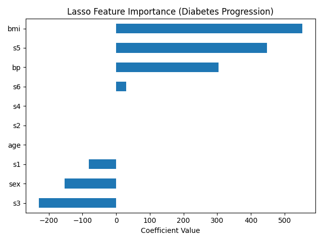

# Diabetes Progression Prediction using Clinical Features

This project explores the prediction of diabetes disease progression using clinical measurements and machine learning regression models.

The goal of this study is to understand how different physiological features contribute to diabetes progression, with a focus on biomedical and healthcare-oriented data analysis.

This project is being developed as part of a personal portfolio for graduate studies in Biomedical Engineering and related fields.

### Feature Importance Analysis

Lasso regression identified BMI, serum triglycerides (s5), and blood pressure as the most influential predictors of diabetes progression. 
Several features such as age and certain serum measurements were effectively reduced to zero, indicating limited predictive contribution.
This highlights the importance of feature selection in clinical regression tasks.

